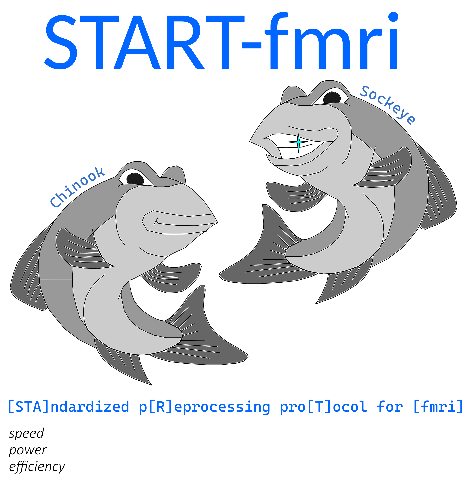
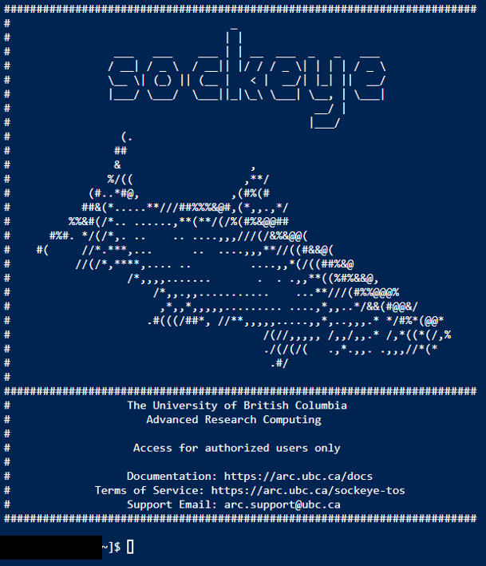

# Welcome to START-fmri!

This is a pipeline that combines fMRIPrep with SPM25 smoothing. The output of this pipeline can be run through downstream statistical analyses, such as fMRI-CPCA.

fMRIPrep: https://fmriprep.org/en/stable/.

Statistical Parametric Mapping (SPM): https://www.fil.ion.ucl.ac.uk/spm/.

# Steps to Run the Pipeline

## Software Setup

To begin, please log onto Sockeye (https://ondemand.arc.ubc.ca/pun/sys/dashboard/) and open the Terminal window:



In the Terminal window above, please run the following code:

```sh
SCRATCH_DIR="/scratch/st-toddwood-1/$USER"

mkdir -p "$SCRATCH_DIR"

cd "$SCRATCH_DIR"

git clone -b Sockeye_Version-3.0 --single-branch https://github.com/jshahki/fmriprep.git

cd /scratch/st-toddwood-1/$USER/fmriprep

source ./code/fmriprep_setup.sh
```

This will set up the environment for running both fMRIPrep and SPM25 smoothing.

Please ensure to keep the Terminal window open while this process completes.

## Running fMRIPrep on your data
After placing your BIDS organized data into the data folder, please run the following code on Terminal:

```sh
cd /scratch/st-toddwood-1/$USER/fmriprep
git pull

# Set how many subjects per array task
SUB_SIZE=1

# Set the participants file
PARTICIPANTS_FILE="./data/participants.tsv"

# Check if the file exists
if [ ! -f "$PARTICIPANTS_FILE" ]; then
  echo "Error: File not found: $PARTICIPANTS_FILE"
  exit 1
fi

# Detect delimiter (tab or comma)
DELIM=$(head -n 1 "$PARTICIPANTS_FILE" | grep -o $'\t' | wc -l)
if [ "$DELIM" -ge 1 ]; then
  # It's a TSV
  CUT_CMD="cut -f1"
else
  # Assume CSV
  CUT_CMD="cut -d',' -f1"
fi

# Read subject IDs into array (skip header)
mapfile -t SUBJECTS < <(tail -n +2 "$PARTICIPANTS_FILE" | eval "$CUT_CMD" | sed 's/\r//')

# Count valid subjects
N_SUBJECTS=${#SUBJECTS[@]}

# Compute array length
array_job_length=$(( (N_SUBJECTS + SUB_SIZE - 1) / SUB_SIZE ))

# Echo info
echo "Subjects found: $N_SUBJECTS"
echo "Subjects per task: $SUB_SIZE"
echo "Number of array jobs: $array_job_length"
echo "Loaded subjects: ${SUBJECTS[*]}"

# Submit the array job
sbatch --array=0-$((array_job_length - 1)) ./code/fmriprep_per_subject.sh
```

## Splitting 4D Volumes into Separate 3D Volumes

This step is required for inputting the fMRI data into SPM25.

```sh
cd /scratch/st-toddwood-1/$USER/fmriprep
git pull

PARTICIPANTS_FILE="./data/participants.tsv"
SUB_SIZE=1  # Subjects per job

# Read subject IDs from file (ignore header)
mapfile -t SUBJECTS < <(tail -n +2 "$PARTICIPANTS_FILE" | cut -f1 | tr -d '\r' | sed '/^$/d')

N_SUBJECTS=${#SUBJECTS[@]}
ARRAY_LENGTH=$(( (N_SUBJECTS + SUB_SIZE - 1) / SUB_SIZE ))

echo "Found $N_SUBJECTS subjects. Launching array with $ARRAY_LENGTH jobs."

sbatch --array=0-$((ARRAY_LENGTH - 1)) ./code/split_bold_volumes.sh
```

## Resizing Voxels to Reference Scan

This step is required for use of fMRI-CPCA downstream.

```sh
cd /scratch/st-toddwood-1/$USER/fmriprep
git pull

PARTICIPANTS_FILE="./data/participants.tsv"
SUB_SIZE=1  # Subjects per job

# Read subject IDs from file (ignore header)
mapfile -t SUBJECTS < <(tail -n +2 "$PARTICIPANTS_FILE" | cut -f1 | tr -d '\r' | sed '/^$/d')

N_SUBJECTS=${#SUBJECTS[@]}
ARRAY_LENGTH=$(( (N_SUBJECTS + SUB_SIZE - 1) / SUB_SIZE ))

echo "Found $N_SUBJECTS subjects. Launching array with $ARRAY_LENGTH jobs."

sbatch --array=0-$((ARRAY_LENGTH - 1)) ./code/reslice_bold_volumes.sh
```

## Running SPM25 Smoothing

This step is where SPM25 smoothing is performed on the fMRI data.

```sh
cd /scratch/st-toddwood-1/$USER/fmriprep
git pull

PARTICIPANTS_FILE="./data/participants.tsv"
SUB_SIZE=1  # Subjects per job

# Read subject IDs from file (ignore header)
mapfile -t SUBJECTS < <(tail -n +2 "$PARTICIPANTS_FILE" | cut -f1 | tr -d '\r' | sed '/^$/d')

N_SUBJECTS=${#SUBJECTS[@]}
ARRAY_LENGTH=$(( (N_SUBJECTS + SUB_SIZE - 1) / SUB_SIZE ))

echo "Found $N_SUBJECTS subjects. Launching array with $ARRAY_LENGTH jobs."

sbatch --export=KERNEL="8 8 8" --array=0-$((ARRAY_LENGTH - 1)) ./code/smoothing_bold_volumes.sh
```

## Generating a Brief Preprocessing Summary

This step generates a brief summary of the number of smoothed volumes for each subject. The summary can be found in the /derivatives/smoothed/final_smoothed_data_summary.csv file, which can be opened using Excel.

```sh
cd /scratch/st-toddwood-1/$USER/fmriprep
git pull

sbatch ./code/summary.sh
```

## OPTIONAL: Saving the Smoothed Output

This step can be performed if you would like to download the smoothed output to a local computer. The following commands can be run on a new Terminal window to download the smoothed output, which can then be run using downstream analysis pipelines. The path to the download folder on the local desktop can be modified as needed.

For Ubuntu:
```sh
rsync -avz --progress username@sockeye.arc.ubc.ca:/scratch/st-toddwood-1/username/fmriprep/derivatives/smoothed/ ~/Downloads/your/location/here/
```

For Windows:
```sh
scp -r -C -v username@sockeye.arc.ubc.ca:/scratch/st-toddwood-1/username/fmriprep/derivatives/smoothed/ C:\Users\username\Downloads\your\location\here\
```
